# Amazon_Vine_Analysis
ETL with Amazon RDS, Pyspark, Pandas, and PostgreSQL
 

Tyrone Fraley 
UC Berkley Extension 
December 30, 2022 

 

  

 

## Overview

The purpose of this analysis is to analyze Amazon digital video reviews that were written by members of the paid Amazon Vine program. Amazon Vine is a service that allows manufacturers and publishers to get reviews for their products. There are many companies that take part in this (i.e. SellBy) who pay a fee to Amazon and send products to Amazon Vine members which are then required to leave a review. In regards to this project there were approximately 50 datasets in Amazon Vine and each contained product reviews. Digital video was the data set of choice for this project. To perform ETL on the data sets I used Pyspark for extraction purposes, I then transformed the data, connected to an AWS RDS instance, and loaded the data to pgAdmin. Finally, Pandas was used to determine any hints of bias in the data set.

Core technologies used:
    * PySpark
    * Google Colab
    * Amazon AWS
        * RDS with PostgreSQL
    * pgAdmin
    * Amazon Reviews Data (https://s3.amazonaws.com/amazon-reviews-pds/tsv/index.txt)
        *https://s3.amazonaws.com/amazon-reviews-pds/tsv/amazon_reviews_us_Digital_Video_Download_v1_00.tsv.gz)

To begin the ETL process with pyspark (spark version - 3.2.3)  I used the digital video reviews dataset url provided by Amazon Vine (https://s3.amazonaws.com/amazon-reviews-pds/tsv/amazon_reviews_us_Digital_Video_Download_v1_00.tsv.gz) . Once the dataset was extracted I then placed it into a data frame. This would allow me to review the variables within the data set. 

 

  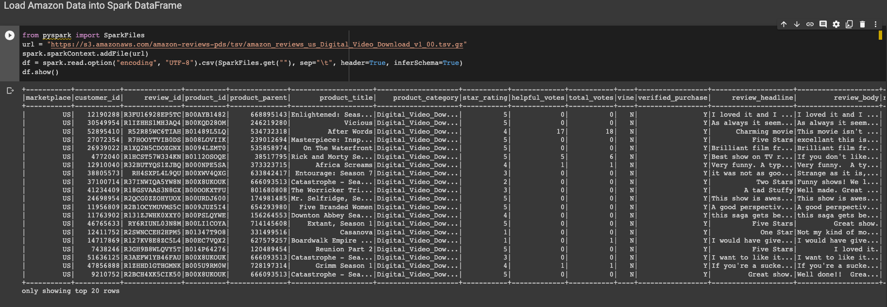

 

Before creating seperate tables to push to sql I dropped any null values (dropna()) from the dataset. The first table would be based on the customer_id and customer_count columns which would be grouped into a dataframe called customers_df. This data set allows me to see the count of customers and each unique id for the customers. 

 

  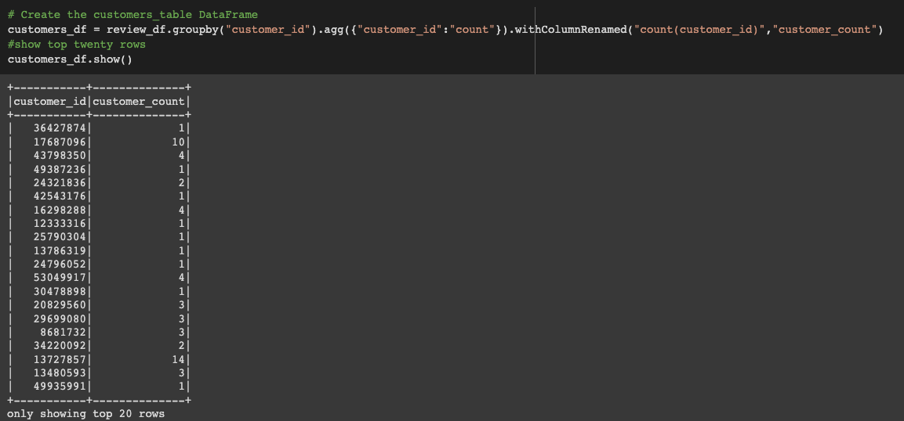

 

Next, I created the products_table. This table would include the product_id and the product_title columns. Product_title contained the different types of video content. Product_id would pair the product title with a unique identification code. This table was then transferred to sql. 

 

  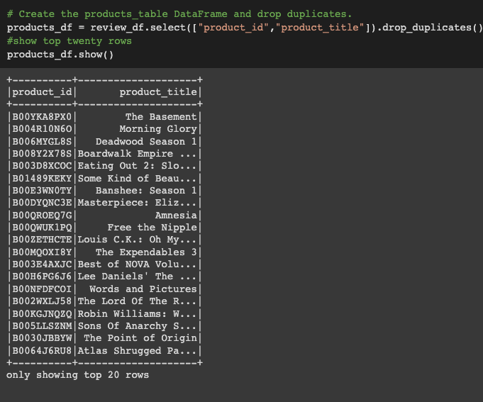

 

The third table in the analysis would be the review_id_table. This table was comprised of the revie_id, customer_id, product_id, product_parent, and review_date columns. This table would allow me to analyze each customer id paired with its corresponding review and product identification code. As well as the product_parent code and the review date. The review date column was assigned as a year - month - day format (to_date("review_date", 'yyyy-MM-dd').alias("review_date"))). 

 

  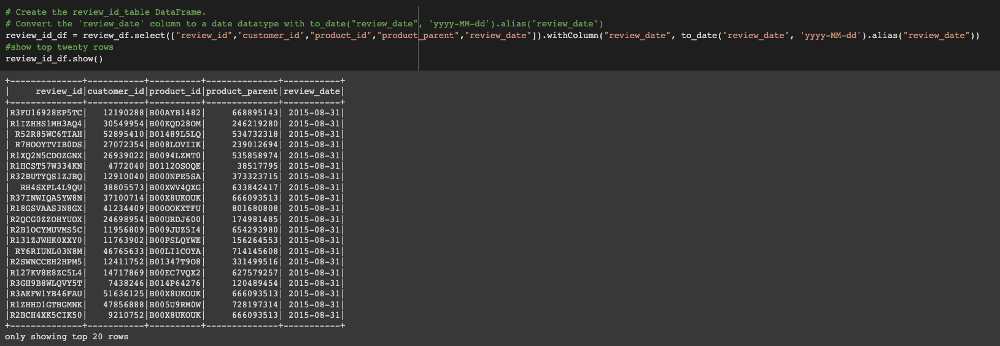

 

The vine_tabe was the final table created for upload into sql. This table was based on the review_id, star_rating, helpful_votes, total_votes, vine, and verified_purchase columns. It should be noted that the vine column contains whether the user was a paid member or not. 

 

  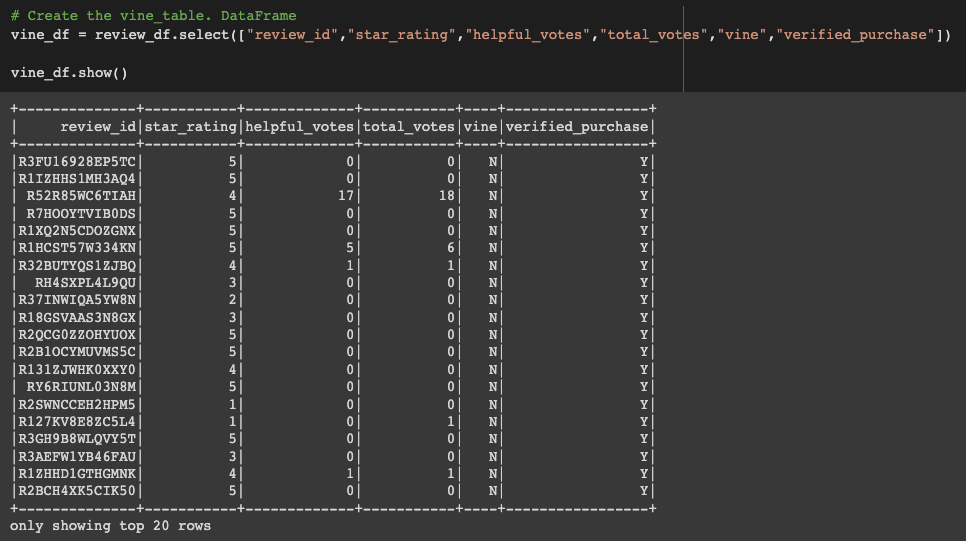

 

Connecting to the AWS RDS instance was the next essential step in my ETL process before conducting a thorough analysis on the dataset. Connecting to the AWS RDS will allow me to load each of the four tables into sql later in my process. To accomplish this, I stored the environmental variable and then configured the settings for RDS with the following function: 

from getpass import getpass
password = getpass('Enter database password')

mode = "append"
jdbc_url="jdbc:postgresql://digitalvideodb.cjfsykz40lex.us-east-1.rds.amazonaws.com:5432/"
config = {"user":"postgres", 
          "password": password, 
          "driver":"org.postgresql.Driver"}
          
Each table was written into the RDS utilizing df.write.(url=jdbc_url, table='review_id_table', mode=mode, properties=config). Upon every entry into the RDS each unique table name was used in accordance with its line of code. This allows RDS to understand which table is specifically being exported to it. Now that I am able to use the tables in PostgreSQL. I connected postgres to my RDS by using my unique AWS RDS password and link. 

Vine Table in SQL:

 

  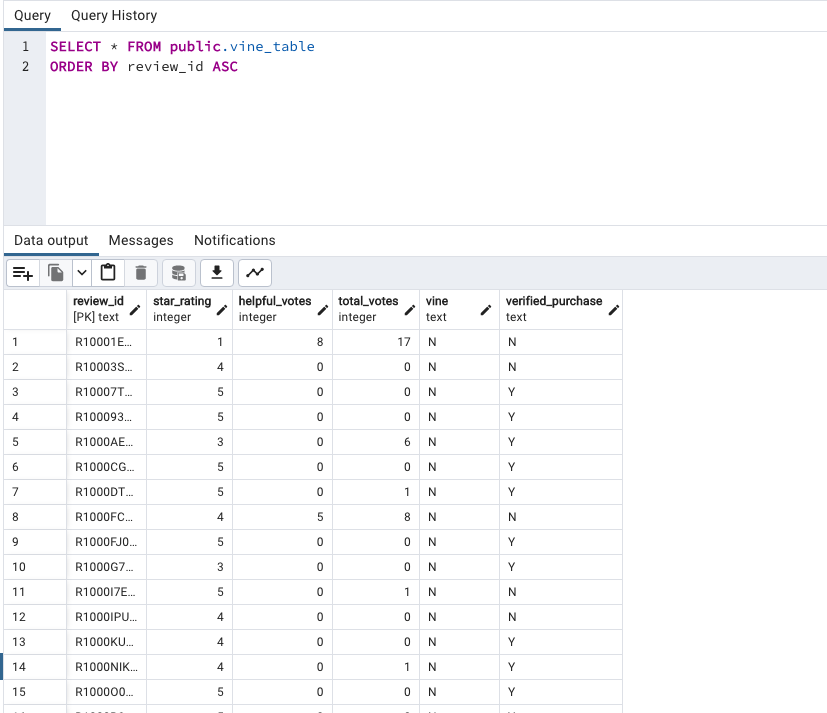

 
Review ID Table in SQL:

 

  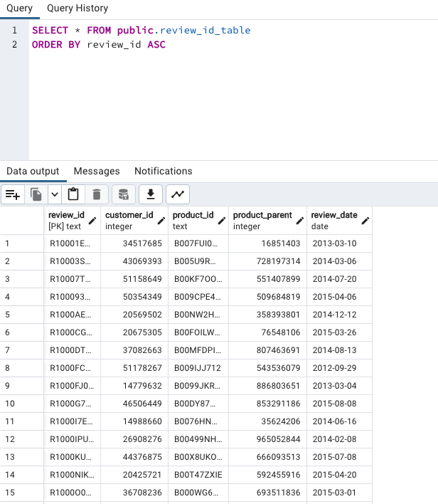

 

Products Table in SQL:

 

  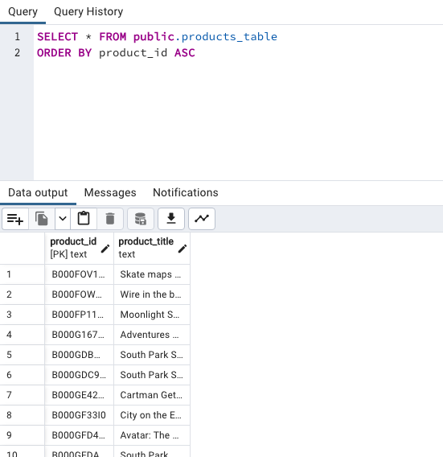

 

Customer ID Table in SQL:

 

  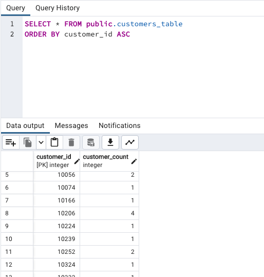

 

Now that the tables were placed into SQL I was closer to finalizing the analysis. However, before this could be completed I began creating four new data frames. The first data frame was calle dthe total_votes_df (total_votes_df = vine_df.filter("total_votes>=20"), total_votes_df.orderBy("total_votes", ascending=False).show()). The total_votes df allows me to retrieve all of the rows where the total_votes count is equal to or greater than 20. I then created the helpful_votes_df (helpful_votes_df = total_votes_df.filter("helpful_votes/total_votes>=0.5")). This data frame allows me to observe all the rows where the number of helpful votes would be equal to or greater than 50% of the votes. The third data frame was the paid_df data frame that allowed me to filter the helpful_votes_df by associating all 'Y' values within the vine column to indicate that the vine program was a paid instance. The fourth was an unpaid_df which was similar to the paid_df however, the filter for the vine column was 'N' for non paid.

 

  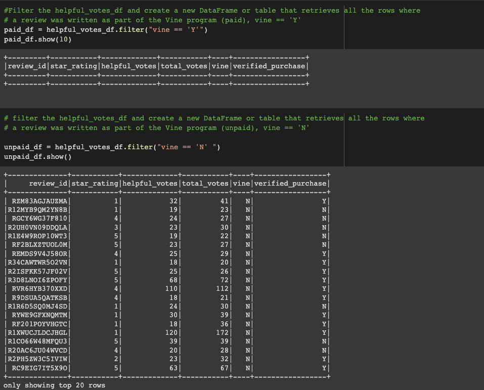

 

# Results

    The downside to this data set was that it was actually quite skewed and I was unable to perform a true bias test within the dataset due to lack of sufficient data. The reason is behind the paid reviews. The paid reviews resulted in a total of 0 which seems a bit off. However, if one were to surmise some sort of bias they could place the bias on the fact there are no paid reviews within the data set. The total number of unpaid reviews wwas 11,362. The total number of unpaid 5-star reviews was 4670 which was 41% of the data set. 
    
    

 

  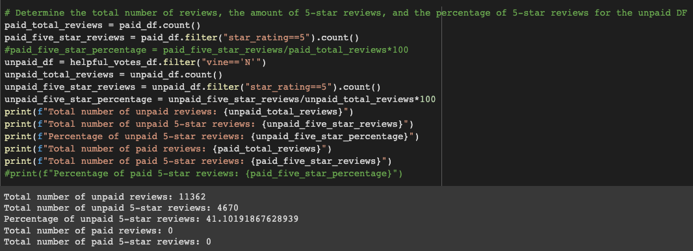

 

# Summary

Upon compeletion of my analysis I noted that bias was not able to be fully calculated in the data set. This was based on that there were no paid variables within the vine column. If so, I would be able to further analyze the paid vs unpaid reviews and determine if there was a bias in accordance to how one gets compensated for reviews. In a future study if the paid variable (Y) were to exist in the dataset's vine column. One could further examine the relationship between paid and unpaid statuses against review counts. I would recommend segmenting the reviews into 5 star reviews, 4-5 stars, and equal to or less than 3 star reviews.

